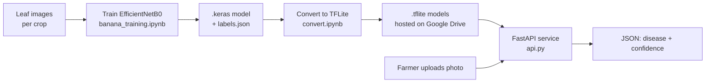

# 🌱 KrishiNova — Plant Disease Detection

**Deep-learning models and a serving API that let farmers detect crop leaf diseases from a photo.**

This repository holds the **machine-learning and API backend** for KrishiNova: per-crop image classifiers trained with EfficientNetB0 transfer learning, converted to TFLite for lightweight inference, and served through a FastAPI endpoint that the KrishiNova web platform calls.

<p align="left">
  
  
  
  
</p>

---

## Overview

Each supported crop has its own binary/multi-class classifier trained on labelled leaf images. A farmer picks a crop in the web app, uploads one or more leaf photos, and gets back the most likely disease with a confidence score. Models are trained in Keras, then converted to quantized TFLite files so the serving layer stays small and fast. The API loads each crop's model on demand and returns a JSON prediction.

The web frontend lives in a separate repository: **[smart-agriculture-web-platform](https://github.com/rh-rakib04/smart-agriculture-web-platform)**.

---

## Screenshots

| Plant Disease Detection dashboard | Upload leaf images | Analysis results |
|---|---|---|
|  |  |  |

---

## Features

- **Per-crop classifiers** — a dedicated model per crop instead of one crowded model, so each stays accurate on its own disease set.
- **Transfer learning** — EfficientNetB0 (ImageNet) with a two-phase train → fine-tune strategy.
- **Class-imbalance handling** — balanced class weights computed from the training set.
- **Quantized TFLite models** — dynamic-range quantization shrinks each model for lightweight, on-device-style inference.
- **On-demand model loading** — the API downloads and caches a crop's model the first time it's requested, keeping the repo and memory footprint small.
- **Simple REST interface** — a single `POST /predict/{crop}` endpoint that any frontend can call.

---

## How It Works



1. **Train** a classifier per crop (`banana_training.ipynb` is the reference; every other crop is trained the same way).
2. **Convert** the saved `.keras` models to `.tflite` in bulk (`convert.ipynb`).
3. **Serve** the TFLite models through `api.py`, which downloads each model on first use and runs inference.

---

## Supported Crops

Currently served by the API: **Mango, Brinjal, Chili, Spinach, Cabbage, Cauliflower, Papaya**.

Additional crops have training data prepared and are being added to the serving layer: Banana, Potato, Tomato, Rice, Jackfruit.

Each crop's classes are defined by its `*_labels.json` file (index → disease name), generated automatically at training time from the dataset folder names.

---

## Project Structure

```
KrishiNova/
├── Models/                 # per-crop model cache (.tflite + *_labels.json), created at runtime
│   ├── mango/
│   ├── brinjal/
│   └── ...
├── banana/                 # example crop dataset (class-named subfolders)
│   ├── fusarium_wilt/
│   ├── healthy/
│   ├── natural_death_leaf/
│   └── rhizome_root/
├── brinjal/  chili/  spinach/  ...   # other crop datasets
├── api.py                  # FastAPI serving app
├── banana_training.ipynb   # training notebook (reference for all crops)
├── convert.ipynb           # batch .keras -> .tflite converter
├── requirements.txt
└── runtime.txt             # Python version pin for deployment
```

> `venv/`, `__pycache__/`, and `.ipynb_checkpoints/` should be listed in `.gitignore`.

---

## Tech Stack

- **Modeling:** TensorFlow / Keras, EfficientNetB0, scikit-learn (class weights)
- **Optimization:** TensorFlow Lite (dynamic-range quantization)
- **Serving:** FastAPI, Uvicorn, Pillow, NumPy
- **Model hosting:** Google Drive (downloaded on demand)

---

## Getting Started

### Prerequisites

- Python 3.x
- `pip` and a virtual environment tool

### Installation

```bash
git clone https://github.com/Shawcha20/<your-repo>.git
cd <your-repo>

python -m venv venv
source venv/bin/activate        # Windows: venv\Scripts\activate

pip install -r requirements.txt
```

### Run the API

```bash
uvicorn api:app --reload
```

The service starts on `http://127.0.0.1:8000`. Interactive docs are available at `http://127.0.0.1:8000/docs`.

---

## API Reference

### `POST /predict/{crop}`

Predict the disease for a single leaf image of a given crop.

**Path parameter**

| Name | Type | Description |
|------|------|-------------|
| `crop` | string | Crop name, e.g. `mango`, `brinjal`, `chili` (case-insensitive). |

**Body** — `multipart/form-data`

| Field | Type | Description |
|-------|------|-------------|
| `file` | file | The leaf image (JPG/PNG). Resized to 224×224 internally. |

**Example request**

```bash
curl -X POST "http://127.0.0.1:8000/predict/mango" \
  -F "file=@leaf.jpg"
```

**Example response**

```json
{
  "crop": "mango",
  "disease": "Gall Midge",
  "confidence": 23.0
}
```

On the first request for a crop, the API downloads that crop's TFLite model and labels from Google Drive and caches them under `Models/{crop}/`, so the first call is slower than subsequent ones.

---

## Model Training

`banana_training.ipynb` is the reference pipeline; every crop is trained the same way on its own dataset folder.

- **Input:** 224×224 RGB leaf images, organised into one subfolder per class inside the crop's `dataset/` directory.
- **Augmentation & split:** `ImageDataGenerator` with rescale `1/255`, rotation ±30°, zoom 0.2, horizontal flip, and an 80/20 train/validation split.
- **Imbalance handling:** balanced class weights computed with scikit-learn.
- **Architecture:** `EfficientNetB0` (ImageNet, `include_top=False`) → `GlobalAveragePooling2D` → `Dropout(0.3)` → `Dense(num_classes, softmax)`.
- **Two-phase training:**
  1. **Head only** — base frozen, `Adam(lr=1e-3)`.
  2. **Fine-tune** — unfreeze the base, drop to `Adam(lr=1e-5)`.
- **Callbacks:** `EarlyStopping` (monitor `val_loss`, restore best weights) and `ModelCheckpoint` (save best `val_accuracy`).
- **Outputs:** `{crop}_model.keras` and `{crop}_labels.json` (index → class name).

A `predict_disease(img_path)` helper is included and mirrors the preprocessing used by the API.

> Epoch counts in the committed notebook are set low for quick runs — raise `INITIAL_EPOCHS` and `FINE_TUNE_EPOCHS` for full training.

---

## Model Conversion

`convert.ipynb` walks the `Models/` directory, finds every `.keras` file, and converts it to `.tflite`:

- `tf.lite.TFLiteConverter.from_keras_model(...)`
- `optimizations = [tf.lite.Optimize.DEFAULT]` — dynamic-range quantization
- `experimental_new_converter = True` — MLIR converter

The quantized `.tflite` files are what the API serves.

---

## Deployment Notes

- **Model hosting:** trained `.tflite` files are stored on Google Drive; `api.py` maps each crop to its Drive links in `MODEL_URLS` and downloads on demand. This keeps large binaries out of the Git repo.
- **Python version:** pinned via `runtime.txt` for platforms like Render.
- **CORS:** currently open (`allow_origins=["*"]`) for the web frontend — tighten this to your frontend's origin before production.

---

## Roadmap

- Wire the remaining trained crops (Banana, Potato, Tomato, Rice, Jackfruit) into the serving API.
- Report per-crop validation accuracy and confusion matrices.
- Add a health-check endpoint and request validation for unsupported crops.
- Restrict CORS origins and add basic rate limiting.

---

## Author

**Mahamudul Islam Shawcha** — CSE, Khulna University of Engineering & Technology (KUET)
[GitHub](https://github.com/Shawcha20) · [LinkedIn](https://www.linkedin.com/in/shawcha/) · [Portfolio](https://shawchaportfolio.netlify.app/)

---

## License

Add a license of your choice (e.g. MIT) as a `LICENSE` file in the repository root.


